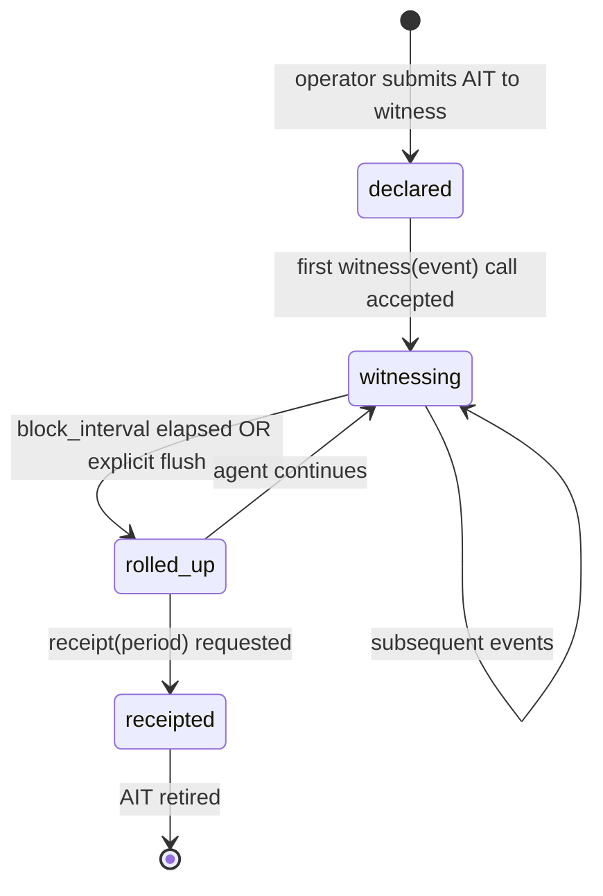
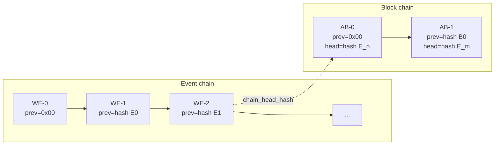

# ATAP v0.1 — Agent Trust Attestation Protocol

| | |
|---|---|
| **Standard** | ATAP v0.1 |
| **Status** | v0.1 — Public comment through 2026-08-12 |
| **Published** | 2026-05-14 |
| **Canonical URL** | https://tunnelmind.ai/atap/standard |
| **Key publication** | https://tunnelmind.ai/atap/keys |
| **Profile registry** | https://tunnelmind.ai/atap/profiles |
| **Reference verifier** | https://tunnelmind.ai/atap/verify.sh |
| **Editor** | TunnelMind |
| **License** | CC BY 4.0 (spec) · MIT (reference implementations) |

---

## 1. Abstract

ATAP is an open protocol for **agent behavioral attestation**: a canonical receipt format that lets the principal of an agentic system — the advertiser, the compliance officer, the regulator, the auditor — cryptographically verify what an agent actually did, in chronological order, without trusting the agent's self-report. v0.1 specifies five artifacts: the AIT capability declaration, the Witness Event record, the Attestation Block roll-up, the Receipt ZIP compliance export, and the hash-chain plus Ed25519 signature model that binds them together. ATAP is invoked from inside the agent (or a trusted dependency such as an MCP server, a verification API, or a language-model SDK wrapper) via a single `witness(event)` call. The witness service is the trusted intermediary that signs and chains every artifact — the AIT itself, every Witness Event, every Attestation Block, every Receipt. There is no kernel observer in v0.1 and none is required. The receipt format is designed so that stronger observation tiers — sidecar daemons, TEEs, kernel attestation — can be introduced in later versions without invalidating earlier receipts or breaking the reference verifier. The format is the moat.

---

## 2. Object identifiers

ATAP defines four canonical object types and one external reference type. Each has a fixed identifier form.

| Type | Form | Notes |
|---|---|---|
| AIT | `AIT-{uuidv7}` | Agent Identity Token. One per agent instance lifetime. |
| Witness Event | `ATAP-WE-{uuidv7}` | One per witnessed action. |
| Attestation Block | `ATAP-AB-{uuidv7}` | Roll-up of one or more Witness Events. |
| Receipt | `ATAP-RCPT-{uuidv7}` | Compliance export bundle. |
| Witness service | OAI canonical | Witness services are identified by canonical OAI under the `witness.operator` category (Section 9.2). |

### 2.1 Why uuidv7

uuidv7 (RFC 9562) encodes a Unix-epoch millisecond prefix, giving natural time-ordering and database-friendly insertion locality. Agent instances, events, blocks, and receipts are short-lived high-cardinality objects unsuitable for a per-year sequence like OAI: a single media-buying agent emits thousands of events per second, and any registry-issued sequence would become the system bottleneck. uuidv7 is the only identifier scheme in v0.1; v2 MAY introduce others.

### 2.2 Formal grammar (ABNF, RFC 5234)

```abnf
ait        = "AIT-" uuidv7
atap-we    = "ATAP-WE-" uuidv7
atap-ab    = "ATAP-AB-" uuidv7
atap-rcpt  = "ATAP-RCPT-" uuidv7
uuidv7     = 8HEXDIG "-" 4HEXDIG "-" "7" 3HEXDIG "-" 4HEXDIG "-" 12HEXDIG
HEXDIG     = DIGIT / %x61-66       ; 0-9 lowercase a-f
DIGIT      = %x30-39
```

The literal `7` in the third group enforces uuidv7 at parse time; uuidv4 and other versions MUST be rejected.

### 2.3 Bounds

| Field | Length |
|---|---|
| AIT | 40 characters |
| Witness Event ID | 45 characters |
| Attestation Block ID | 45 characters |
| Receipt ID | 47 characters |

### 2.4 Witness service identifier

A witness service — the surface that signs and chains all ATAP artifacts on behalf of a principal — is identified by canonical OAI under the **`witness.operator`** category, added to OAI v1.0 §3 as an editorial expansion on 2026-05-14 alongside the publication of this standard. The AIT field `witness`, the public-key lookup at `/atap/keys`, and the Receipt `witness` field all reference this OAI.

### 2.5 Anti-collision

A witness service MUST reject any AIT whose `id` it has previously signed under any other AIT. uuidv7's 74 bits of post-timestamp entropy make accidental collisions vanishingly improbable; rejection of seen IDs guards against deliberate impersonation by an adversary that scrapes published AITs and replays them under a different operator.

---

## 3. Scope

ATAP v0.1 specifies a protocol and a receipt format for the following:

| In scope | Definition |
|---|---|
| Capability declaration | Up-front statement of what the agent intends to do, in machine-parseable form (AIT). |
| Per-action witnessing | Record of each action the agent took, signed by a trusted witness service. |
| Periodic roll-up | Aggregation of witness events into hash-chained blocks. |
| Compliance export | Portable archive (Receipt ZIP) suitable for an auditor to verify independently. |
| Independent verification | Public reference verifier (`verify.sh`) and reference TypeScript wrapper (`@tunnelmindai/atap`). |

Application-specific extensions (the witness vocabulary for media buying, e-commerce, data brokerage, etc.) are out of scope for the base protocol and live in **application profiles** (Section 9). The base protocol provides the structural envelope; the profile fills it with domain-specific event types and aggregation rules.

---

## 4. Out of scope

The following are deliberate non-goals in v0.1. Each exclusion is load-bearing; do not work around them.

| Excluded | Why |
|---|---|
| Kernel-level observation | eBPF, syscall tracing, and TEE attestation are out of scope for v0.1 — they require a multi-engineer engineering effort that delays the protocol indefinitely. Stronger observation tiers MAY be added in later versions without breaking the receipt format. |
| Cross-platform agent runtime | ATAP does not provide an execution environment for agents. It is invoked from inside the agent's existing code. |
| Real-time agent behavior modification | ATAP records what the agent did, after the fact. It is not a policy engine and does not block actions. Policy engines MAY consume ATAP receipts as input. |
| Identity proofing of the human operator | ATAP attests to agent behavior, not operator identity. The principal verifies the agent by the witness service's signature on the AIT; KYC of the operator is the witness service's responsibility, out of scope for the protocol. |
| User-side privacy claims | ATAP receipts attest the agent's behavior toward third parties, not the privacy of any user data the agent processed. v0.1 forbids PII in the witness payload (Section 7.6) but does not enforce broader privacy properties. |
| Generic logging | Witness Events are signed, hash-chained, and structurally constrained. They are not a substitute for application logs and SHOULD NOT carry free-text or debug content. |

---

## 5. Stability guarantees

| Property | Guarantee |
|---|---|
| Receipt ZIP layout | Frozen at v0.1. The file names and directory structure in Section 7.5 do not change within v0.1. |
| Hash construction | Frozen at v0.1: SHA-256 over canonical JSON per RFC 8785 (JCS). v2 MAY add additional hash algorithms but MUST preserve the SHA-256 chain as a parallel artifact for verifier backwards compatibility. |
| Signature algorithm | Ed25519 (RFC 8032). v0.1 ships only this algorithm. v2 MAY add post-quantum signatures (e.g. ML-DSA per NIST FIPS 204) in parallel; v2 MUST NOT replace Ed25519 for v0.1 receipt verification. |
| Public-key endpoint | The URL `https://tunnelmind.ai/atap/keys` and its response shape are stable for the lifetime of v0.1. |
| Verifier | `verify.sh` published under v0.1 verifies every v0.1 receipt for the lifetime of v0.1. v2 verifiers MUST also verify v0.1 receipts. |

A receipt issued under v0.1 remains independently verifiable indefinitely. The standard never invalidates an existing receipt.

---

## 6. Lifecycle

An ATAP-instrumented agent traverses six states:



| State | Description |
|---|---|
| `declared` | The operator has submitted an AIT to the witness service. The witness has validated and signed it. No events have been witnessed yet. |
| `witnessing` | The agent is actively calling `witness(event)`. The witness service signs and chains each event. |
| `rolled_up` | The witness service has emitted at least one Attestation Block summarizing prior Witness Events. The chain head is the most recent block. |
| `receipted` | A Receipt covering some period has been generated. The AIT MAY continue witnessing after a Receipt is taken. |
| Retired | The AIT will accept no more events. Retirement is recorded as a final Witness Event of type `ait.retired`; the witness service MUST refuse subsequent events for this AIT. |

`witnessing` → `rolled_up` is the only periodic transition; all others are event-triggered.

### 6.1 AIT acceptance

The operator constructs an AIT object with all fields populated except `witness_signature`. The operator submits the AIT to the witness service. The witness validates: schema conformance, profile registration, that the AIT's `id` has not been seen before, that the `witness` field matches its own canonical OAI, and that the operator's identity satisfies the witness's onboarding policy (out of scope for v0.1). On success the witness signs the canonical bytes of the AIT minus `witness_signature` and returns the signed AIT.

A signed AIT is the agent's credential. Subsequent `witness(event)` calls reference it by `id`.

### 6.2 Block roll-up triggers

A witness service MUST roll up pending events into a new Attestation Block when ANY of:

1. The block interval declared in the AIT's `attestation_policy.block_interval_seconds` elapses since the previous block.
2. The pending event count exceeds the witness service's configured ceiling (default 10,000; configurable per profile).
3. The agent's principal requests a flush via `POST /v1/atap/flush`.
4. The witness service is about to shut down or rotate keys.

Witness services MAY roll up more frequently than the declared interval. They MUST NOT roll up less frequently.

### 6.3 AIT lifetime

An AIT SHOULD have a useful lifetime no longer than 90 days. An AIT MUST be retired no later than 365 days after `issued_at`. Long-lived AITs accumulate key-rotation, profile-version, and policy-drift risk. Profiles MAY specify tighter ceilings; profiles MUST NOT relax the 365-day cap.

The witness service MUST refuse `witness(event)` for an AIT older than its profile's maximum lifetime or older than 365 days, whichever is shorter, even if no retirement event has been recorded.

---

## 7. Schemas

All four object types are JSON. The on-the-wire encoding is JSON-LD where context is required for downstream tooling; the canonical form for hashing is RFC 8785 (JSON Canonicalization Scheme).

### 7.1 AIT (Agent Identity Token)

```json
{
  "@context": "https://tunnelmind.ai/atap/context.jsonld",
  "@type": "AgentIdentityToken",
  "id": "AIT-018f3c4d-7b2a-7d8e-9f01-4a5b6c7d8e9f",
  "ait_version": "0.1",
  "issued_at": "2026-05-14T08:00:00Z",
  "expires_at": "2026-08-12T08:00:00Z",
  "agent_type": "media-buyer",
  "profile": "sigil:media_buyer:v1",
  "operator": "OAI-2026-0000234",
  "witness": "OAI-2026-0000017",
  "capabilities": [
    "bid:submit",
    "bid:read_response",
    "supply:verify_via_sigil",
    "budget:read",
    "budget:decrement",
    "creative:select",
    "report:generate",
    "report:export_receipt"
  ],
  "constraints": {
    "max_bid_cpm": 50.00,
    "currency": "USD",
    "allowed_channels": ["display", "video", "ctv", "audio"],
    "blocked_domains": ["example-blocked.com"],
    "blocked_categories": ["IAB25-3", "IAB26"],
    "geo_targeting": {"allowed_countries": ["US", "CA"]},
    "supply_trust_minimum": 0.7,
    "budget_daily_cap": 10000.00,
    "budget_total_cap": 150000.00
  },
  "attestation_policy": {
    "witness_granularity": "per_action",
    "block_interval_seconds": 300,
    "receipt_generation": "on_demand"
  },
  "witness_signature": "ed25519:0x..."
}
```

| Field | Type | Required | Notes |
|---|---|---|---|
| `@context` | string (URL) | Yes | Const `https://tunnelmind.ai/atap/context.jsonld`. |
| `@type` | string | Yes | Const `AgentIdentityToken`. |
| `id` | string | Yes | `AIT-{uuidv7}`. |
| `ait_version` | string | Yes | Const `"0.1"` for v0.1. |
| `issued_at` | string (date-time) | Yes | RFC 3339, set by the witness at signing. |
| `expires_at` | string (date-time) | Yes | RFC 3339. `expires_at - issued_at` MUST be ≤ 365 days. |
| `agent_type` | string | Yes | Free identifier, 1–64 characters; common values defined per profile. |
| `profile` | string | Yes | Application profile identifier (Section 9). |
| `operator` | string | Yes | Canonical OAI of the agent operator. Reference field; the operator does not sign. |
| `witness` | string | Yes | Canonical OAI of the witness service (`witness.operator` category). |
| `capabilities` | array of string | Yes | Declared capability set. Profile defines the vocabulary. Minimum 1, maximum 64 items. Items are 1–64 characters, pattern `^[a-z][a-z0-9_]*(:[a-z][a-z0-9_]*)+$`. |
| `constraints` | object | No | Profile-defined constraint object. Profile schemas MUST validate this object; v0.1 imposes no constraints on its shape beyond JSON-validity and a 4 KB canonical-byte ceiling. |
| `attestation_policy` | object | Yes | See 7.1.1. |
| `witness_signature` | string | Yes | Ed25519 signature by the witness service over canonical bytes of the AIT minus the `witness_signature` field. Format `ed25519:0x{128hex}`. |

#### 7.1.1 attestation_policy

| Field | Type | Required | Notes |
|---|---|---|---|
| `witness_granularity` | string | Yes | `per_action` or `per_decision`. Profile MAY define additional values. |
| `block_interval_seconds` | integer | Yes | Block roll-up cadence. **60 ≤ value ≤ 3600.** Lower values prevent meaningful aggregation; higher values widen the worst-case adversarial window. Profiles MAY specify tighter ceilings. |
| `receipt_generation` | string | Yes | `on_demand`, `per_block`, or `per_period`. |

### 7.2 Witness Event

```json
{
  "@context": "https://tunnelmind.ai/atap/context.jsonld",
  "@type": "WitnessEvent",
  "id": "ATAP-WE-018f3c4d-7b2a-7d8e-9f01-4a5b6c7d8e9f",
  "ait": "AIT-018f3c4d-7b2a-7d8e-9f01-4a5b6c7d8e9f",
  "witnessed_at": "2026-05-14T08:00:01.123Z",
  "event_type": "bid:submitted",
  "payload": {
    "exchange": "openx.com",
    "publisher_domain": "example-publisher.com",
    "seller_id": "12345",
    "bid_amount": 1.45,
    "creative_id": "cr-abc-123",
    "sigil_token": "sigil:tok:abc...",
    "supply_trust_score": 0.91
  },
  "prev_event_hash": "0x9f3a8b2e...",
  "self_hash": "0xa1b2c3d4...",
  "witness_signature": "ed25519:0x..."
}
```

| Field | Type | Required | Notes |
|---|---|---|---|
| `@context` | string (URL) | Yes | Const. |
| `@type` | string | Yes | Const `WitnessEvent`. |
| `id` | string | Yes | `ATAP-WE-{uuidv7}`. |
| `ait` | string | Yes | AIT this event was witnessed under. |
| `witnessed_at` | string (date-time) | Yes | RFC 3339, millisecond precision. Recorded by the witness service, not the agent. |
| `event_type` | string | Yes | Colon-delimited profile-defined identifier. Pattern: `^[a-z][a-z0-9_]*(:[a-z][a-z0-9_]*)+$`. |
| `payload` | object | Yes | Profile-defined event payload. Canonical-bytes serialization MUST NOT exceed 16 KB. v0.1 imposes the constraint in Section 7.6. |
| `prev_event_hash` | string | Yes | SHA-256 of the previous Witness Event in the chain for this AIT, hex with `0x` prefix. The first event uses the constant `0x` followed by 64 zero hex characters. |
| `self_hash` | string | Yes | SHA-256 over canonical bytes of this event minus `self_hash` and `witness_signature`. Hex with `0x` prefix. |
| `witness_signature` | string | Yes | Ed25519 signature by the witness service over the bytes of `self_hash`. Format `ed25519:0x{128hex}`. |

#### 7.2.1 Replay protection

A witness service MUST reject a `witness(event)` call whose intended `witnessed_at` would be more than 30 seconds older than the current witness clock. The witness sets `witnessed_at` itself at signing time; clock skew between the agent and the witness is the agent's problem to handle. This bounds the window during which a stolen credential could be used to back-date events.

### 7.3 Attestation Block

```json
{
  "@context": "https://tunnelmind.ai/atap/context.jsonld",
  "@type": "AttestationBlock",
  "id": "ATAP-AB-018f3c4d-7b2a-7d8e-9f01-4a5b6c7d8e9f",
  "ait": "AIT-018f3c4d-7b2a-7d8e-9f01-4a5b6c7d8e9f",
  "ab_version": "0.1",
  "profile": "sigil:media_buyer:v1",
  "period_start": "2026-05-14T08:00:00Z",
  "period_end": "2026-05-14T08:05:00Z",
  "first_event": "ATAP-WE-018f3c4d-7b2a-7d8e-9f01-4a5b6c7d8e9f",
  "last_event": "ATAP-WE-018f3c4d-9a8b-7d8e-9f01-4a5b6c7d8e9f",
  "event_count": 1247,
  "chain_head_hash": "0xa1b2c3d4...",
  "period_summary": {
    "bids_submitted": 1247,
    "bids_won": 89,
    "total_spend": 342.17,
    "unique_publishers": 34,
    "unique_exchanges": 5,
    "supply_verifications": 1247,
    "supply_rejections": 203,
    "average_trust_score": 0.84,
    "constraint_violations": 0,
    "channels_used": ["display", "video"],
    "geos_reached": ["US"]
  },
  "prev_block_hash": "0x9f3a8b2e...",
  "self_hash": "0xab12cd34...",
  "witness_signature": "ed25519:0x..."
}
```

| Field | Type | Required | Notes |
|---|---|---|---|
| `@context` | string (URL) | Yes | Const. |
| `@type` | string | Yes | Const `AttestationBlock`. |
| `id` | string | Yes | `ATAP-AB-{uuidv7}`. |
| `ait` | string | Yes | The AIT. |
| `ab_version` | string | Yes | Const `"0.1"`. |
| `profile` | string | Yes | Application profile identifier. |
| `period_start` | string (date-time) | Yes | RFC 3339. |
| `period_end` | string (date-time) | Yes | RFC 3339. `period_end > period_start`. |
| `first_event` | string | Yes | First Witness Event ID in the block. |
| `last_event` | string | Yes | Last Witness Event ID in the block. |
| `event_count` | integer | Yes | Inclusive count, ≥ 1. |
| `chain_head_hash` | string | Yes | `self_hash` of the last event in the block. |
| `period_summary` | object | Yes | Profile-defined aggregation. v0.1 imposes only Section 7.6. |
| `prev_block_hash` | string | Yes | `self_hash` of the previous block, or `0x` + 64 zeros for the first block. |
| `self_hash` | string | Yes | SHA-256 over canonical bytes minus `self_hash` and `witness_signature`. |
| `witness_signature` | string | Yes | Ed25519 signature by the witness service over `self_hash`. Format `ed25519:0x{128hex}`. |

### 7.4 Receipt

A Receipt is a metadata record that describes the contents of a Receipt ZIP. The Receipt object itself appears as `manifest.json` inside the ZIP.

```json
{
  "@context": "https://tunnelmind.ai/atap/context.jsonld",
  "@type": "Receipt",
  "id": "ATAP-RCPT-018f3c4d-7b2a-7d8e-9f01-4a5b6c7d8e9f",
  "ait": "AIT-018f3c4d-7b2a-7d8e-9f01-4a5b6c7d8e9f",
  "profile": "sigil:media_buyer:v1",
  "period_start": "2026-05-01T00:00:00Z",
  "period_end": "2026-05-13T23:59:59Z",
  "block_count": 3744,
  "event_count": 4671293,
  "first_block": "ATAP-AB-018ec7a1-...",
  "last_block": "ATAP-AB-018f3c4d-...",
  "chain_head_hash": "0xab12cd34...",
  "witness": "OAI-2026-0000017",
  "format": "full",
  "generated_at": "2026-05-14T09:00:00Z",
  "verifier_url": "https://tunnelmind.ai/atap/verify.sh",
  "keys_url": "https://tunnelmind.ai/atap/keys",
  "files": [
    {"path": "ait.json", "sha256": "0x..."},
    {"path": "attestation_chain.json", "sha256": "0x..."},
    {"path": "summary.json", "sha256": "0x..."},
    {"path": "public_keys.json", "sha256": "0x..."},
    {"path": "verify.sh", "sha256": "0x..."},
    {"path": "compliance_report.pdf", "sha256": "0x..."},
    {"path": "profile_artifacts/", "sha256": null}
  ],
  "witness_signature": "ed25519:0x..."
}
```

| Field | Type | Required | Notes |
|---|---|---|---|
| `id` | string | Yes | `ATAP-RCPT-{uuidv7}`. |
| `ait` | string | Yes | |
| `profile` | string | Yes | |
| `period_start` / `period_end` | string (date-time) | Yes | Bounds of the receipt. |
| `block_count` / `event_count` | integer | Yes | |
| `first_block` / `last_block` | string | Yes | First and last Attestation Block IDs included. |
| `chain_head_hash` | string | Yes | `self_hash` of `last_block`. |
| `witness` | string | Yes | Canonical OAI of the witness service. |
| `format` | string | Yes | `full` or `summary`. `summary` omits the per-event chain. |
| `files` | array of object | Yes | Manifest of every file in the ZIP with SHA-256. Empty `sha256` permitted for directories. |
| `witness_signature` | string | Yes | Ed25519 signature over canonical bytes of this Receipt minus the signature field. Format `ed25519:0x{128hex}`. |

### 7.5 Receipt ZIP layout

```
ATAP-RCPT-{uuidv7}.zip
├── manifest.json              # The Receipt object (7.4)
├── ait.json                   # The AIT under which the period was witnessed
├── attestation_chain.json     # Array of AttestationBlocks, ordered, hash-chained
├── summary.json               # Aggregated period_summary across all blocks
├── public_keys.json           # Witness service Ed25519 public keys covering the period
├── verify.sh                  # Reference verifier (bash + openssl + jq)
├── compliance_report.pdf      # Optional human-readable rendering
└── profile_artifacts/         # Profile-specific files; structure defined by profile
    ├── sigil_tokens.json      # Example: media_buyer profile
    └── ...
```

The layout is frozen for v0.1. Receipts MUST contain `manifest.json`, `ait.json`, `attestation_chain.json`, `public_keys.json`, and `verify.sh`. The other files are optional but, when present, MUST conform to this layout.

#### 7.5.1 Why a directory for profile artifacts

The base receipt verifies the chain. The profile artifacts carry the application-specific evidence that gives the chain meaning: for media buying, the Sigil verification tokens that justify each bid; for e-commerce, the order-state attestations; for content scraping, the per-source consent records. Putting them in a sibling directory lets `verify.sh` succeed without understanding the profile, while leaving an obvious place for profile-aware tools to look.

### 7.6 Payload constraint: no PII

Witness Event payloads, Attestation Block summaries, and profile artifacts MUST NOT contain personally identifiable information about end users. The following are explicitly forbidden:

| Forbidden | Notes |
|---|---|
| End-user IP addresses | The IP of the user the agent acted on behalf of, or against. **Third-party destination IPs (servers, ASNs, exchanges) ARE permitted** — Section 3 explicitly admits them. |
| User-agent strings | Carries device, browser, and OS fingerprinting signal. |
| Cookies, session identifiers, OAuth tokens | Bearer credentials and pseudonymous identifiers. |
| Email addresses, phone numbers, physical addresses | Direct identifiers. |
| Account IDs at consumer services | Including but not limited to social-network user IDs, e-commerce account numbers, gaming-platform handles tied to natural persons. |
| Wallet addresses tied to a natural person | Cryptocurrency identifiers that are known or reasonably inferable to belong to a specific individual. Pseudonymous wallets used solely by autonomous agents are permitted. |
| Biometric identifiers | Facial geometry, fingerprints, voiceprints, gait signatures. |
| Browser or device fingerprints | Canvas, WebGL, audio-context hashes, plugin enumerations, font lists, hardware identifiers (MAC, IMEI, serial). |
| Content of user communications | Message bodies, search queries with user attribution, chat transcripts. |

What IS in scope: destinations (domains, ASNs, server-side IP ranges, app-bundle IDs), aggregate volumes, timings, prices, capability identifiers, profile-defined trust signals, and any field whose resolution does NOT reach a natural person.

Profile maintainers MUST encode this constraint in their JSON Schemas. Profiles that fail to do so MUST NOT be admitted into the registry (Section 9.3).

### 7.7 Canonical bytes for hashing and signing

Every `self_hash` and every signature is computed over the **canonical JSON bytes** of the object minus the hash and signature fields. Canonical JSON is JSON Canonicalization Scheme, RFC 8785. Implementations MUST NOT compute hashes over the raw JSON-LD as transmitted; differences in whitespace, key ordering, or numeric representation would silently invalidate signatures.

The canonical procedure for a Witness Event:

1. Construct the event object with all fields except `self_hash` and `witness_signature`.
2. Serialize via RFC 8785 JCS.
3. Compute SHA-256 → `self_hash`.
4. Sign the bytes of `self_hash` with the witness service's Ed25519 private key → `witness_signature`.
5. Add `self_hash` and `witness_signature` to the object for transmission and storage.

The same procedure applies, with the corresponding field exclusions, to Attestation Blocks and Receipts.

For the AIT, the procedure is identical except that the field excluded from canonicalization is `witness_signature` only (there is no `self_hash` on an AIT — the AIT is signed directly).

**Ed25519 conventions in v0.1.** Signatures are 64 bytes, hex-encoded as 128 lowercase characters with the `ed25519:0x` prefix. Public keys are 32 bytes, hex-encoded as 64 lowercase characters with the `0x` prefix.

---

## 8. Key publication

Public keys for witness services are published at:

```
GET https://tunnelmind.ai/atap/keys
```

### 8.1 Response shape

```json
{
  "keys": [
    {
      "witness": "OAI-2026-0000017",
      "key_id": "k1",
      "algorithm": "ed25519",
      "public_key": "0x...",
      "valid_from": "2026-05-01T00:00:00Z",
      "valid_until": "2027-05-01T00:00:00Z",
      "status": "active",
      "rotated_to": null,
      "compromise_notice": null
    },
    {
      "witness": "OAI-2026-0000017",
      "key_id": "k0",
      "algorithm": "ed25519",
      "public_key": "0x...",
      "valid_from": "2025-05-01T00:00:00Z",
      "valid_until": "2026-05-01T00:00:00Z",
      "status": "rotated",
      "rotated_to": "k1",
      "compromise_notice": null
    }
  ],
  "updated_at": "2026-05-14T08:00:00Z"
}
```

A key per witness service:

| Status | Meaning |
|---|---|
| `active` | Currently signing new events. |
| `rotated` | Superseded by `rotated_to`. Verifies historical events whose `witnessed_at` falls within `[valid_from, valid_until]`. |
| `compromised` | Withdrawn. Verifiers MUST reject signatures from this key when validating receipts whose `witnessed_at` is later than `compromise_notice.disclosed_at`. Receipts whose `witnessed_at` predates `disclosed_at` SHOULD be marked `unverified` rather than valid; downstream policy MAY treat them differently. |

When `status` is `compromised`, the `compromise_notice` object is required:

```json
{
  "disclosed_at": "2026-09-12T14:30:00Z",
  "detected_at": "2026-09-12T13:45:00Z",
  "summary_url": "https://tunnelmind.ai/atap/compromise/2026-09-12.html"
}
```

### 8.2 Key selection at verification time

Given a Witness Event with `witnessed_at: t` and `witness_signature`, the verifier selects the key where:

```
key.witness     == event.ait.witness   (looked up via the AIT)
key.valid_from  <= t < key.valid_until
key.status      != "compromised"
   OR (key.status == "compromised" AND t < key.compromise_notice.disclosed_at)
```

There is exactly one such key at any moment per witness service. If zero or more than one key matches, the verifier MUST reject the event.

### 8.3 Rotation cadence

Witness services SHOULD rotate keys at least every **6 months** under normal operation. Witness services MUST rotate keys within **1 hour** of any reasonable suspicion of compromise.

### 8.4 Compromise disclosure

When a witness service detects key compromise:

1. The witness service MUST mark the key `compromised` at `/atap/keys` within **1 hour** of detection. `disclosed_at` and `detected_at` MUST both be populated.
2. The witness service MUST publish a `summary_url` describing the incident within **24 hours** of disclosure.
3. The witness service MUST rotate the key (publish a successor under the same witness OAI with `status: active`) within **1 hour** of disclosure.

Caching at the edge (Section 8.5) is configured to permit propagation of compromise notices in under 5 minutes globally.

### 8.5 Caching

| Field | Cache-Control |
|---|---|
| `/atap/keys` (full document) | `public, max-age=300, stale-while-revalidate=3600` |

Verifiers MAY pin a snapshot of `/atap/keys` for the duration of a single verification run (typically seconds to minutes). Verifiers MUST NOT pin a snapshot longer than 24 hours; a 24-hour pin is the recommended ceiling. Pinning beyond that risks treating a compromised key as valid.

---

## 9. Witness model and application profiles

### 9.1 The witness is whoever the principal trusts

ATAP v0.1 makes one structural decision the implementation hinges on: **the witness is not the agent.** The witness is a service that observes the agent's actions, signs them, and chains them. The principal verifies the chain by checking the witness's signature.

This is a weaker trust model than kernel attestation. The witness can be deceived by an agent that bypasses it. v0.1 accepts this trade-off because (a) bypassing the witness is detectable as a chain discontinuity, (b) a documented witness-signed chain is strictly better than today's unsigned campaign logs, and (c) the receipt format is forward-compatible with stronger observation tiers.

For the v0.1 reference deployment in programmatic advertising, **Sigil is the witness**: the agent calls `sigil.verify/supply_path` before each bid, Sigil sees the decision, Sigil signs and chains it. No separate observer is required. Other application domains follow the same pattern: choose an interface the principal already trusts, and make it the witness.

### 9.2 Witness service identification

Witness services are identified by canonical OAI under the **`witness.operator`** category. This category was added to OAI v1.0 §3 as an editorial expansion on 2026-05-14 alongside the publication of this standard. Existing witness services that hold `sensor.operator` OAIs MAY continue to use them; new witness services SHOULD register under `witness.operator`.

### 9.3 Application profiles

A **profile** is a published document that defines, for a specific agent domain:

1. The vocabulary of `event_type` strings the agent's witness emits.
2. The JSON Schema for each event type's `payload`.
3. The JSON Schema for `period_summary` aggregation.
4. The JSON Schema for `constraints` in the AIT.
5. The contents of `profile_artifacts/` in the Receipt ZIP.

Profiles are identified by a colon-delimited string of the form `{namespace}:{domain}:v{N}`. Examples:

| Profile | Maintainer | Status in v0.1 |
|---|---|---|
| `sigil:media_buyer:v1` | TunnelMind (via Sigil) | Reference profile, ships alongside v0.1. |
| `sigil:ecommerce_buyer:v1` | TBD | Reserved. |
| `sigil:data_broker:v1` | TBD | Reserved. |

The profile registry is published at `https://tunnelmind.ai/atap/profiles` and the source-of-truth repository is `https://github.com/TunnelMind/atap-profiles`. Third-party profiles MAY be registered subject to the constraints in Sections 7.6 (no PII) and 9.4 (acceptance criteria).

### 9.4 Acceptance criteria

A profile proposal is accepted into the registry if all of the following hold:

1. The proposed JSON Schemas validate as JSON Schema 2020-12.
2. The Schemas encode the PII prohibition of Section 7.6 — verified by automated test cases the proposer includes in the PR.
3. The proposed namespace token is not already claimed (first-comer wins).
4. The proposal includes at least one signed example AIT, Witness Event, Attestation Block, and Receipt that round-trip through the reference verifier.

Profile proposals are PRs to `github.com/TunnelMind/atap-profiles`. CI runs the four checks above and **auto-merges** PRs that pass within 7 calendar days, absent an editorial objection (Section 12.2). The editor's hand-review is reserved for scope and conflict cases.

### 9.5 Profile authority and collisions

The proposer of an accepted profile is its authoritative maintainer. ATAP v0.1 does **not** arbitrate when multiple parties want the same domain: they get separate namespaces. `sigil:media_buyer:v1` and `acme:media_buyer:v1` MAY coexist; verifiers select the profile referenced by the AIT they are verifying.

---

## 10. Hash chain and transparency

### 10.1 The chain

ATAP maintains two parallel hash chains per AIT:



- The **event chain** binds Witness Events in monotone order. Every event's `prev_event_hash` is the previous event's `self_hash`.
- The **block chain** binds Attestation Blocks. Every block's `prev_block_hash` is the previous block's `self_hash`.
- A block's `chain_head_hash` references the `self_hash` of the last event it covers, binding the block chain to the event chain.

A break in either chain is a verification failure.

### 10.2 Genesis

The first Witness Event and the first Attestation Block for an AIT use the constant `prev_event_hash` and `prev_block_hash` of `0x0000000000000000000000000000000000000000000000000000000000000000` (32 zero bytes, hex-encoded — `0x` followed by 64 zero characters).

### 10.3 Hash algorithm

SHA-256 over canonical JSON bytes (RFC 8785). v0.1 ships only SHA-256. The signed quantity for each Witness Event, Attestation Block, and Receipt is the raw 32-byte hash; the wire form prefixes `0x`.

### 10.4 Transparency log (deferred to v1.x)

A public append-only log of Attestation Block heads, modelled on Certificate Transparency (RFC 6962), is the strongest near-term addition to the trust model. v0.1 reserves the URL `https://tunnelmind.ai/atap/log` and the optional Attestation Block field `log_index`. Verifiers MUST tolerate `log_index` values that cannot yet be checked against a live log endpoint; the absence of a log does not invalidate a v0.1 receipt.

The transparency log is on the v1.x roadmap, scheduled to land once ATAP has measurable external adoption (see Section 12.1). It is not a v2 deliverable; v2 work (post-quantum, federation) is downstream of it.

### 10.5 What the chain proves

The chain proves:

- **Append-only.** No event was inserted, removed, or reordered after the next event was signed.
- **Witness attribution.** Each event, each block, and the AIT itself was signed by the declared witness service.
- **Period coverage.** A receipt's chain head matches the last block in `attestation_chain.json`; if any block was omitted, the chain head will not match.

The chain does NOT prove:

- That the agent did not perform actions outside the witness's view. (Mitigated in later versions by stronger observation tiers.)
- That the witness's signed events accurately reflect reality. (Mitigated by witness reputation, witness-OAI registry, the transparency log when shipped, and out-of-band evidence.)

These limits are honest; the standard does not promise what its trust model cannot deliver.

---

## 11. Verification

### 11.1 The reference verifier

`verify.sh` is a single-file bash script using `openssl` and `jq`, intended to be readable in one sitting. It is published at:

```
https://tunnelmind.ai/atap/verify.sh
```

and is included verbatim in every Receipt ZIP. The verifier:

1. Parses `manifest.json` and validates the SHA-256 of every other file matches the manifest entry.
2. Validates the AIT's structure against the v0.1 schema and verifies its `witness_signature` against the appropriate public key.
3. Walks the event chain in `attestation_chain.json` (or the block chain in `summary` format), verifying each block's `self_hash`, `prev_block_hash`, `chain_head_hash`, and `witness_signature` against the keys in `public_keys.json`.
4. Reports per-block status to stdout; exits 0 if every block verifies, 1 otherwise.

### 11.2 Reference TypeScript wrapper

A TypeScript implementation of `witness(event)` is published as:

```
npm: @tunnelmindai/atap
source: https://github.com/TunnelMind/atap/tree/main/packages/atap-js
```

The wrapper is non-normative; it is provided to lower the cost of correctly integrating ATAP. Implementations in other languages are welcomed and need only conform to Section 7 and Section 10.

### 11.3 Verification environments

`verify.sh` runs anywhere bash 4+, `openssl` 1.1+, and `jq` 1.6+ are present. The reference TypeScript wrapper targets Node 20+ and ESM. No managed runtime, no specific cloud provider, no vendor dependency. This is load-bearing for adoption: a verifier that requires the principal to trust a specific cloud cannot become the citation format.

---

## 12. Governance

### 12.1 Editor

TunnelMind edits ATAP v0.1. TunnelMind is a single-operator project, not a foundation, not a consortium, and not a venture-backed entity. There is no board, no token, and no third-party investor with editorial influence. The editor's role is provisional; the conditions under which it transfers to a neutral host mirror those in OAI v1.0 §12.4 — external adoption (three or more independent organizations publishing ATAP receipts), standards-track recognition (IETF / W3C / MITRE citation), and operational maturity (99.9% key endpoint uptime, zero canonical-URL breaks) sustained over two consecutive quarters.

### 12.2 Conflict of interest

TunnelMind operates Sigil, a commercial witness service for media buying that consumes ATAP. To bound the conflict:

- Profile acceptance follows the published automated criteria in Section 9.4 and is not influenced by whether the proposing party is a customer, partner, or competitor of TunnelMind's commercial products. The CI checks are public and reproducible; their pass/fail decision is not subject to editor override on technical grounds, only on scope grounds.
- Editorial decisions on scope, schema constraints, and out-of-scope exclusions (Section 4) are public and reversible only by a versioning event (Section 13).
- The editor MUST NOT accept payment, sponsorship, or grant funding in exchange for profile acceptance or schema changes. Funding not tied to specific schemas or profiles is permissible and MUST be disclosed at `tunnelmind.ai/atap/funding`.

### 12.3 Automated workflow

The editor's stated commitment is to **not be a bottleneck**. To that end:

| Channel | Automation |
|---|---|
| **Profile proposals** | PR to `github.com/TunnelMind/atap-profiles`. CI validates Section 9.4 checks. Schema-conformant PRs auto-merge within **7 calendar days** absent an editorial objection. |
| **Schema bug reports** | Issue on `github.com/TunnelMind/atap`. Automated acknowledgment within 24 hours. Editor triage within 7 calendar days. |
| **Objections** | Issue on `github.com/TunnelMind/atap-profiles` with `objection` label. Automated acknowledgment within 24 hours. Editor written response within **14 calendar days**. Auto-acknowledgment is not a substantive response. |
| **Compromise disclosures** | Direct contact (security email TBD) plus public posting at `/atap/compromise/`. Section 8.4 sets SLOs. |

These SLOs are tighter than OAI's because the automation makes them feasible; OAI's longer windows reflect manual issuance decisions that ATAP does not require.

### 12.4 Continuity

The protocol spec, the JSON Schemas, the reference verifier, and the reference TypeScript wrapper are open: the spec is licensed CC BY 4.0 and the code artifacts are MIT-licensed. A current snapshot of the spec, schemas, profile registry, and public-key archive is publicly downloadable at `tunnelmind.ai/atap/archive/` and updated at least monthly.

In the event the editor cannot operate the standard, the canonical URLs (`/atap/standard`, `/atap/keys`, `/atap/verify.sh`, `/atap/profiles`) MAY be repointed to a successor neutral host with a 301. Receipts issued under v0.1 continue to verify against the archived public keys regardless of editor identity.

### 12.5 Editor failure modes

A single-operator editor has failure modes a foundation does not. Even with automation:

- **Profile review hand-cases.** Conflicts between proposals competing for the same scope, or proposals raising novel PII or scope concerns, require editor judgment. The 7-day auto-merge SLO does not apply when the editor opens a hand-review on a PR. Hand-reviews target 14 calendar days.
- **Capacity ceiling.** If editorial workload exceeds what the automation plus the solo editor can sustain, the editor invokes the Transition RFC ahead of the standard-transfer gate. Premature transition is a recognized exit, not a failure.

These constraints are honest about scale rather than aspirational about it.

---

## 13. Versioning

ATAP follows semantic versioning at the **standard** level, not the receipt level.

| Change class | Version impact |
|---|---|
| Editorial clarification, no schema impact | None — re-publish in place. |
| New optional field on AIT, Witness Event, Attestation Block, or Receipt | Minor — v0.1.x. |
| New required field, change to hash construction, change to signature algorithm, change to ZIP layout | Major — v0.2 (pre-v1) or v1 (first stable). |
| Promotion to v1 | Requires the conditions in Section 12.1 plus a 90-day public comment period on the v1 RFC. |

v0.1 is **pre-stable**. The schemas in Section 7 may evolve through v0.1.x without breaking already-issued receipts. Once v1 is published, the v1 schemas are frozen at `additionalProperties: false` for the lifetime of v1.

A v2 verifier MUST verify v0.1 and v1 receipts.

---

## 14. Locked positions and forward-looking work

This section records decisions that v0.1 commits to, distinguishing them from items genuinely deferred. Public comment on the locked positions is welcomed; the editor's prior is that they hold for v1.

### 14.1 Receipt revocation: LOCKED — immutability

Signed-and-shipped receipts are **immutable**. There is no protocol-level revocation. The only remediation path is witness-key compromise (Section 8.4): when a key is marked `compromised`, downstream verifiers downgrade receipts signed by it after `disclosed_at` to invalid, and receipts signed before `disclosed_at` to `unverified` (policy-dependent). Corrections to recorded reality go in a **new chain** under a new AIT.

Rationale: a revocable receipt is not a receipt. A compliance receipt's value is that the principal can verify it without coordinating with the issuer. A retroactively editable receipt collapses to a self-report. The cost of immutability is that erroneous receipts cannot be redacted; the standard accepts this cost.

### 14.2 Profile-domain collisions: LOCKED — first-comer wins, no editor arbitration

Multiple parties wanting the same agent domain (e.g. two different organizations proposing competing `media_buyer` profiles) get **separate namespaces**: `partyA:media_buyer:v1` and `partyB:media_buyer:v1`. The editor does NOT arbitrate competing technical claims. Verifiers select the profile referenced by the AIT they are verifying.

Rationale: arbitration introduces editor bias risk and a slow path. Separate namespaces are honest about disagreement and let the market converge by adoption.

### 14.3 Algorithm agility: LOCKED — SHA-256 + Ed25519 frozen at v0.1

v0.1 ships SHA-256 and Ed25519 exclusively. v2 MAY add (not replace) post-quantum signatures and SHA-3 hashes. During the v2 transition, every artifact will be signed and hashed in BOTH the v0.1 algorithms and the v2 algorithms, so that v0.1 verifiers continue to function. v2 receipts retire only when the surrounding cryptographic environment retires SHA-256 / Ed25519.

### 14.4 Witness federation: DEFERRED to v2

v0.1 binds each AIT to exactly one witness service. Multi-witness co-signing of events (a stronger-assurance pattern for high-stakes domains) is deferred to v2 governance.

### 14.5 Cross-AIT linking: OUT OF SCOPE for v0.1

The same operator running multiple AITs across instances, time, or business units is identified at the OAI operator level (the `operator` field). No protocol-level AIT-to-AIT linking is provided in v0.1.

### 14.6 Privacy-preserving aggregation (zero-knowledge attestations): RESEARCH

Zero-knowledge proofs over sensitive aggregate signals (e.g. attesting "total spend was under cap X" without revealing the exact value) are a research direction. They are not on the v1 roadmap. Profiles needing this capability today should structure their `period_summary` to omit sensitive values rather than mask them.

### 14.7 Transparency log: SCHEDULED for v1.x

The append-only log of Attestation Block heads (Section 10.4) is the highest-leverage near-term addition to the trust model and is the first v1.x priority once external adoption is measurable. URL `/atap/log` is reserved.

---

## Appendix A. References

- RFC 3339 — Date and Time on the Internet: Timestamps
- RFC 5234 — Augmented BNF for Syntax Specifications: ABNF
- RFC 6962 — Certificate Transparency (model for the future transparency log)
- RFC 8032 — Edwards-Curve Digital Signature Algorithm (Ed25519)
- RFC 8785 — JSON Canonicalization Scheme (JCS)
- RFC 9562 — Universally Unique IDentifiers (UUIDs), including uuidv7
- JSON Schema 2020-12 — https://json-schema.org/draft/2020-12/schema
- JSON-LD 1.1 — https://www.w3.org/TR/json-ld11/
- NIST FIPS 204 — Module-Lattice-Based Digital Signature Standard (ML-DSA, referenced for v2 post-quantum direction)
- OAI v1.0 — https://tunnelmind.ai/oai/standard (companion standard, identifier scheme for witness services)

## Appendix B. Implementation references

| Artifact | Location |
|---|---|
| Spec document (this file) | `tunnelmind-site/docs/ATAP-v0.1.md` and `github.com/TunnelMind/atap/ATAP-v0.1.md` |
| JSON Schemas | `tunnelmind-site/public/atap/schemas/v0.1/` |
| JSON-LD context | `https://tunnelmind.ai/atap/context.jsonld` |
| Reference verifier | `tunnelmind-site/public/atap/verify.sh` and bundled inside every Receipt ZIP |
| Reference TypeScript wrapper | `@tunnelmindai/atap` on npm · source at `github.com/TunnelMind/atap/packages/atap-js` |
| Profile registry | `github.com/TunnelMind/atap-profiles` (rendered at `tunnelmind.ai/atap/profiles`) |
| Public key endpoint | `https://tunnelmind.ai/atap/keys` |
| Reference profile: media buyer | Sigil P32 — landing once the Sigil build ships |
