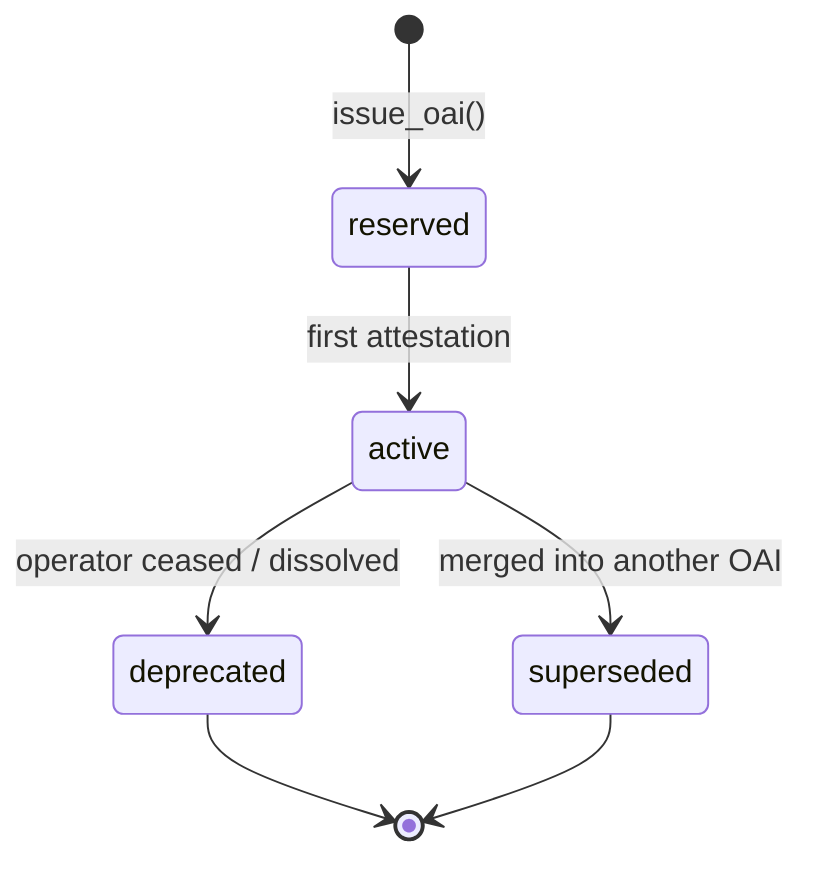

# OAI v1.0 — Observed Actor Identifier Standard

| | |
|---|---|
| **Standard** | OAI v1.0 |
| **Status** | v1.0 — Public comment through 2026-08-12 |
| **Published** | 2026-05-14 |
| **Canonical URL** | https://tunnelmind.ai/oai/standard |
| **Resolver** | https://tunnelmind.ai/id/{id-or-alias} |
| **Editor** | TunnelMind |
| **License** | CC BY 4.0 |

---

## 1. Abstract

OAI is an open identifier standard for entities that observe, profile, or act against users, devices, and networks: trackers, fingerprinters, surveillance vendors, ad networks, data brokers, threat actors, and the sensor operators that witness them. It is edited by TunnelMind — a single-operator project intended to transition to a neutral standards body once the conditions in Section 12 are met — and adopts the CVE editorial model: free resolution, permanent canonical identifiers, signed observations. The standard exists because reporting, tooling, and research about observation infrastructure currently lack a stable citation format; an `OAI-YYYY-NNNNNNN` is a stable handle that humans, agents, and downstream resolvers can all share.

---

## 2. Identifier format

OAI defines two identifier forms: a **canonical** identifier and an optional **alias**. Every registered entity has exactly one canonical identifier and zero or more aliases. Aliases resolve to the canonical identifier.

### 2.1 Canonical form

```
OAI-YYYY-NNNNNNN
```

| Component | Definition |
|---|---|
| Prefix | The four-character literal `OAI-`. Uppercase. Required. |
| `YYYY` | Four-digit year of issuance, ISO 8601 calendar year, UTC. |
| Separator | `-` (U+002D). |
| `NNNNNNN` | Seven-digit decimal sequence, zero-padded, monotonically increasing within `YYYY`, starting at `0000001`. |

Formal grammar (ABNF, RFC 5234):

```abnf
oai-canonical = "OAI-" 4DIGIT "-" 7DIGIT
DIGIT         = %x30-39
```

The canonical form is **case-sensitive**: all characters are uppercase except the literal digits. Lowercase or mixed-case canonical identifiers MUST be rejected.

### 2.2 Alias form

```
oai:slug
```

| Component | Definition |
|---|---|
| Prefix | The four-character literal `oai:`. Lowercase. Required. |
| `slug` | Begins with a lowercase letter or digit; remaining characters are lowercase letters, digits, hyphen (`-`), or underscore (`_`). |

Formal grammar:

```abnf
oai-alias = "oai:" alpha-num *(alpha-num / "-" / "_")
alpha-num = %x61-7A / DIGIT          ; a-z and 0-9
```

Aliases are **case-sensitive** and lowercase. An alias MUST NOT collide with another entity's alias. Aliases MUST NOT be reused after being retired.

### 2.3 Bounds

| Field | Min length | Max length |
|---|---|---|
| Canonical `OAI-YYYY-NNNNNNN` | 16 | 16 |
| Alias `oai:slug` (slug part) | 1 | 64 |

### 2.4 Reserved characters

The following characters MUST NOT appear in either form: whitespace, `/`, `?`, `#`, `&`, `=`, `+`, `%`, any uppercase letter in the slug portion of an alias.

---

## 3. Scope

OAI is for entities that **observe, profile, or act against users, devices, or networks** in ways relevant to defensive analysis. The categories accepted in v1:

| Category prefix | Definition |
|---|---|
| `tracker.pixel.*` | Image, script, or beacon embedded in third-party context for the purpose of tracking user activity. Subcategories: `advertising`, `marketing`, `analytics`, `social`. |
| `tracker.fingerprinter` | A script or capability that derives a stable device or browser identifier from observable properties without persistent storage. |
| `surveillance.vendor` | A commercial vendor whose product line is the observation of individuals, networks, or organizations at scale. |
| `ad_network` | An entity operating a programmatic ad exchange, SSP, or DSP whose bid-stream telemetry constitutes user observation. |
| `data_broker` | An entity that aggregates, packages, or sells data about identifiable users or households. |
| `threat.actor` | A named adversary group, intrusion set, or campaign observed conducting hostile activity. |
| `threat.infrastructure` | A piece of infrastructure (botnet, C2 host class, exit-node fleet) attributable to a threat actor or campaign. |
| `sensor.operator` | A registered operator of attested observation sensors. See Section 9. |

A category string is one or more dot-separated lowercase segments, each beginning with `[a-z]` and followed by `[a-z0-9_]*`. The full grammar is enforced by the v1 record schema (Section 7) at `pattern: "^[a-z][a-z0-9_]*(\\.[a-z][a-z0-9_]*)+$"`.

---

## 4. Out of scope

The following are **not** registerable in v1. Each exclusion is deliberate; do not work around them.

| Excluded | Why |
|---|---|
| Normal content sites | OAI is for observation infrastructure, not the open web. |
| Generic SaaS products | The product's purpose is not observation. |
| Individual humans | OAI never identifies natural persons. |
| CDN and origin infrastructure | Unless the infrastructure is surveillance-coupled (the operator's product *is* observation), it is out of scope. |
| Media, gaming, finance, e-commerce, messaging segments | Insufficient signal that the entity's *purpose* is observation rather than a side effect of its business. Excluded from the v1 seed by ranking rule. |
| Internal product names of in-scope operators | Register the operator, not their product SKUs. Use `aliases` for well-known product names where helpful. |

Out-of-scope subjects are not given OAIs even on request. Issuance of an OAI to an out-of-scope subject is grounds for retraction (Section 6).

---

## 5. Stability guarantees

The canonical identifier is **permanent**. Once issued, an OAI:

- MUST NOT be reassigned to a different entity.
- MUST NOT be deleted from the registry.
- MUST remain resolvable for as long as the registry operates.

This is the load-bearing guarantee of the standard. External tooling, citations, and reports rely on `OAI-YYYY-NNNNNNN` being a stable handle. Repointing a canonical ID is a governance failure (see Section 12) and a versioning event.

Aliases are **convenience-stable**: they MUST resolve to the current canonical for as long as they exist, and they MUST NOT be reassigned to a different entity. An alias MAY be retired, in which case it stops resolving. Aliases are not citation-grade and SHOULD NOT appear in long-lived reports without the canonical form alongside.

| Property | Canonical | Alias |
|---|---|---|
| Permanent | Yes | No (may be retired) |
| Reassignable | Never | Never |
| Citation-grade | Yes | No |
| Resolution | Direct | 301 to canonical |

---

## 6. Deprecation policy

An OAI has one of four states:

| Status | Meaning |
|---|---|
| `active` | Currently registered and resolvable as a live entity. |
| `deprecated` | The entity has dissolved, ceased operation, or merged into another entity without supersession. The record remains resolvable for historical reference but is no longer current. |
| `superseded` | The entity has been merged into another registered entity. Callers SHOULD follow the resolver's 303 to the supersession target. |
| `reserved` | An identifier issued but not yet attested. Reserved records are **not publicly resolvable** (Section 8 specifies the response). |

### 6.1 Transitions



`reserved` → `active` requires at least one attestation (Section 10). The v1 record schema enforces this with `if status=active then attestations.minItems=1`.

`active` → `superseded` requires the `superseded_by` column to reference a valid OAI. The registry's `oai_superseded_consistency` CHECK enforces this invariant: a row marked `superseded` MUST have a target, and a row not marked `superseded` MUST NOT.

A canonical ID MUST NOT transition out of `deprecated` or `superseded`. Resurrection is forbidden in v1.

### 6.2 Deprecation headers

Resolvers MUST include `Sunset` (RFC 8594) on `deprecated` responses, set to the timestamp at which the record was deprecated. Resolvers MUST emit a 303 See Other on `superseded` requests, with `Location` set to the resolution URL of `superseded_by`.

---

## 7. Schema

The canonical record format is JSON-LD. Every OAI registry entry conforms to the v1 schema below; v1 is frozen at ship (Section 11).

### 7.1 JSON-LD context

```
@context: https://tunnelmind.ai/oai/context.jsonld
@type:    ObservedActor
```

### 7.2 Fields

| Field | Type | Required | Notes |
|---|---|---|---|
| `@context` | string (URL) | Yes | Const `https://tunnelmind.ai/oai/context.jsonld`. |
| `@type` | string | Yes | Const `ObservedActor`. |
| `id` | string | Yes | Canonical OAI. MUST match the row's `oai_id`. |
| `aliases` | array of string | No | Lowercase `oai:slug` form. Unique items. |
| `name` | string | No | Human-readable display name. 1–256 characters. |
| `category` | string | No | Dot-separated category path per Section 3. |
| `operator` | string | No | Canonical OAI of the operating entity. Free strings not permitted — issue an OAI or omit. |
| `first_observed` | string (date-time) | No | RFC 3339. Earliest observation of this entity in the corpus. |
| `first_observed_by` | string | No | Canonical OAI, OAI-SENSOR, or the literal `public-corpus`. |
| `last_observed` | string (date-time) | No | RFC 3339. Most recent observation. |
| `last_observed_by` | string | No | Canonical OAI, OAI-SENSOR, or `public-corpus`. |
| `domains` | array of string | No | Domain names associated with the entity. Subdomains and punycode permitted; raw IPs are not (use `threat.infrastructure` records, not domains). |
| `fingerprint_methods` | array of string | No | Lowercase identifiers like `canvas`, `webgl`, `audio_context`. |
| `data_sharing` | array of string | No | Canonical OAIs of entities this entity is observed to share data with. |
| `jurisdiction_notes` | object | No | Keys are lowercase ISO 3166-1 alpha-2 country codes; values are free-text strings. v2 may formalize. |
| `attestations` | array of object | Conditional | Required when `status=active`, minimum 1. See 7.3. |
| `status` | string | Yes | One of `active`, `deprecated`, `superseded`, `reserved`. MUST match the row's `status`. |
| `schema_version` | string | Yes | Const `1.0` for v1 records. |
| `issued_at` | string (date-time) | Yes | RFC 3339. Timestamp the OAI was issued. |

### 7.3 Attestation object

```json
{
  "sensor": "OAI-SENSOR-de-001",
  "observed_at": "2026-05-10T14:32:18Z",
  "signature": "ed25519:0x9f3a8b2e...",
  "log_index": 4827193
}
```

| Field | Type | Required | Notes |
|---|---|---|---|
| `sensor` | string | Yes | Canonical OAI-SENSOR identifier. |
| `observed_at` | string (date-time) | Yes | RFC 3339. |
| `signature` | string | Yes | `ed25519:0x` followed by hex-encoded signature. |
| `log_index` | integer | Yes | Position in the transparency log (`/oai/log`). Implementation deferred — index values are reserved by v1, populated when the log ships. |

### 7.4 Worked example

```json
{
  "@context": "https://tunnelmind.ai/oai/context.jsonld",
  "@type": "ObservedActor",
  "id": "OAI-2026-0000042",
  "aliases": ["oai:meta-pixel-v3"],
  "name": "Meta Pixel",
  "category": "tracker.pixel.advertising",
  "operator": "OAI-2026-0000017",
  "first_observed": "2012-10-15T00:00:00Z",
  "first_observed_by": "public-corpus",
  "last_observed": "2026-05-10T14:32:18Z",
  "last_observed_by": "OAI-SENSOR-de-001",
  "domains": ["connect.facebook.net", "www.facebook.com"],
  "fingerprint_methods": ["canvas", "webgl", "audio_context"],
  "data_sharing": ["OAI-2026-0000017", "OAI-2026-0000093"],
  "jurisdiction_notes": {
    "eu": "GDPR enforcement actions: see CNIL-2023-IR-FR-Meta-001",
    "us": "FTC consent order 2024"
  },
  "attestations": [
    {
      "sensor": "OAI-SENSOR-de-001",
      "observed_at": "2026-05-10T14:32:18Z",
      "signature": "ed25519:0x9f3a8b2e...",
      "log_index": 4827193
    }
  ],
  "status": "active",
  "schema_version": "1.0",
  "issued_at": "2026-01-12T08:00:00Z"
}
```

Sequence numbers in the example are illustrative; the live registry may emit different values.

### 7.5 Cross-reference rule

Every cross-reference to another entity (`operator`, `data_sharing`, `attestations[].sensor`, `first_observed_by`, `last_observed_by`) MUST be a canonical OAI or, where applicable, the literal `public-corpus`. Free strings are not permitted in reference fields. If the referenced entity is not yet registered, the publishing party MUST either issue an OAI for it or omit the reference. The registry is a self-referential graph; tolerating free strings in reference fields would silently break that property.

### 7.6 Validation

The registry validates v1 records on insert with a JSON Schema 2020-12 CHECK constraint (see `supabase/migrations/005b_oai_record_schema.sql`). The schema enforces:

- `additionalProperties: false` at the top level. v1 is frozen.
- `schema_version` const-locked to `"1.0"`.
- Pattern-based validation on all OAI cross-references using the canonical and sensor regexes.
- Conditional: `status=active` requires `attestations.minItems=1`.

Application-layer validators SHOULD also validate `format: date-time` strictly; `pg_jsonschema` enforcement of date-time is implementation-dependent.

---

## 8. Resolution

The resolver answers a single endpoint:

```
GET https://tunnelmind.ai/id/{id-or-alias}
```

### 8.1 Behavior

| Input | Match | Response |
|---|---|---|
| Canonical `OAI-YYYY-NNNNNNN` | Found, `status=active` | 200 with record |
| Canonical, `status=deprecated` | Found | 410 Gone with last known record, `Sunset` header |
| Canonical, `status=superseded` | Found | 303 See Other → resolution URL of `superseded_by` |
| Canonical, `status=reserved` | Found | **404 Not Found** (indistinguishable from unknown; see 8.4) |
| Sensor `OAI-SENSOR-{cc}-{seq}` | Found | 200 with sensor record |
| Alias `oai:slug` | Found | 301 Moved Permanently → canonical URL |
| Any input | Not found | 404 Not Found |
| Malformed input | — | 400 Bad Request |

### 8.2 Content negotiation

| Accept | Response body |
|---|---|
| `application/ld+json` | JSON-LD record |
| `application/json` | JSON-LD record (same payload) |
| `text/html` or omitted | Server-rendered HTML card |

### 8.3 Cache-Control

Cache directives are set per status to amplify reads at the CDN edge.

| Status | Cache-Control |
|---|---|
| `active` | `public, max-age=86400, stale-while-revalidate=604800` |
| `deprecated` (410) | `public, max-age=3600, stale-while-revalidate=86400` |
| `superseded` (303) | `public, max-age=300, stale-while-revalidate=3600` |
| `reserved` or `unknown` (404) | `public, max-age=60` |
| Malformed (400) | `public, max-age=60` |

### 8.4 Reserved status MUST NOT leak

Reserved identifiers are pre-issued but not yet attested. Disclosing reservation state to the public — for instance, by responding 451 instead of 404 — would reveal which entities the registry is preparing to add before the operators or affected parties have been notified. Resolvers MUST return 404 for both `reserved` and unknown lookups, with identical bodies and identical cache headers. The 404 body:

```json
{
  "error": "not_found",
  "queried": "<input>",
  "standard": "https://tunnelmind.ai/oai/standard"
}
```

Administrators with service-role access may query the underlying registry directly; the public resolver path MUST NOT distinguish reserved from unknown.

### 8.5 Headers

Every response MUST include:

- `Cache-Control` per Section 8.3.
- `Link: <https://tunnelmind.ai/oai/standard>; rel="describedby"`.
- `ETag` for client-side conditional requests.

### 8.6 Rate limiting

The resolver MUST NOT rate-limit. The resolver MUST NOT require authentication. OAI resolution is a public good and the registry pays the egress cost. This is load-bearing for adoption: a rate-limited or authenticated resolver cannot become the citation format.

CDN-level caching makes the cost manageable; if a single client misbehaves, the appropriate mitigation is the CDN's automated abuse handling, not standard-level rate-limit semantics.

### 8.7 Resolver lookup order

```mermaid
flowchart TD
  A[Input] --> B{match canonical regex OAI-\d{4}-\d{7}}
  B -- yes --> C[query oai_registry]
  B -- no --> D{match sensor regex OAI-SENSOR-[a-z]{2}-\d{3}}
  D -- yes --> E[query oai_sensors]
  D -- no --> F{match alias regex oai:[a-z0-9][a-z0-9_-]*}
  F -- yes --> G[query oai_registry.aliases, 301 to canonical]
  F -- no --> H[400 Bad Request]
```

### 8.8 Ancillary routes

| Route | Purpose |
|---|---|
| `GET /id/` | Human-facing index. Paginated, searchable. |
| `GET /oai/context.jsonld` | JSON-LD context document. |
| `GET /oai/standard` | This document, rendered as HTML. |
| `GET /oai/sitemap.xml` | Sitemap of all `active` records for crawlers. |
| `GET /oai/log` | Transparency log entrypoint. Implementation deferred — Section 10. |

---

## 9. Sensor identifiers

Sensors are attested observation endpoints operated by humans or organizations. They live in a separate namespace from entity OAIs.

### 9.1 Format

```
OAI-SENSOR-{cc}-{seq}
```

| Component | Definition |
|---|---|
| Prefix | `OAI-SENSOR-`. |
| `{cc}` | Lowercase ISO 3166-1 alpha-2 country code. |
| `{seq}` | Three-digit zero-padded sequence, per-country. |

```abnf
oai-sensor = "OAI-SENSOR-" 2(%x61-7A) "-" 3DIGIT
```

### 9.2 Properties

- The sequence is **per country**, beginning at `001`.
- Sequence numbers are **never reissued, never reused** across sensors, even after a sensor is decommissioned.
- A retired sensor retains its identifier with `status: retired`. The record remains resolvable.
- A retired sensor's `pubkey_ed25519` MUST NOT be accepted on new observations.
- A multi-region operator issues a separate sensor identifier under each jurisdiction. An operator running three sensors each in DE, US, and SG holds nine sensor identifiers.

### 9.3 Why ISO 3166-1, not airport codes

The question the sensor identifier answers is **"what legal regime did this observation come from."** Airport codes encode physical location; ISO codes encode jurisdiction. Jurisdictions are what agents and analysts reason about: GDPR applies to a DE sensor regardless of which datacenter hosts it.

### 9.4 Country codes committed at launch

The registry accepts any valid ISO 3166-1 alpha-2 code. The codes TunnelMind operates sensors under at launch:

```
us  de  gb  sg  jp  br  au
```

### 9.5 Resolver behavior

Sensor lookups follow the same flow as entity lookups (Section 8.7). The `oai_sensors` table is publicly readable on all rows by design (see migration `004b_oai_sensors.sql`): the public key is required for signature verification, and operator identity is required by the transparency model.

---

## 10. Attestation model

Every observation contributing to a registry record is signed by a sensor's Ed25519 keypair and chained into a transparency log.

### 10.1 Signature

A sensor signs the canonical-bytes encoding of the observation payload with its Ed25519 private key. The signature accompanies the observation in the `attestations[]` array of the affected registry record. The corresponding public key is the `pubkey_ed25519` of the sensor's `oai_sensors` row.

Signature encoding: `ed25519:0x<hex>`. Verifiers fetch the public key from the resolver at `/id/{sensor-id}`.

### 10.2 Transparency log

The transparency log lives at:

```
https://tunnelmind.ai/oai/log
```

The log MUST be append-only. Each entry binds an attestation to a monotonically increasing `log_index` recorded in the corresponding `attestations[].log_index` field. The log permits any party to verify that a published record was not silently rewritten.

Implementation of the log endpoint is **deferred to a separate standards process**. v1 reserves the URL and the `log_index` field. Consumers MUST tolerate `log_index` values that cannot yet be verified against a live log endpoint.

### 10.3 Promotion to active

A `reserved` record MUST NOT be promoted to `active` with zero attestations. The v1 record schema enforces this. The first attestation that meets the schema may trigger promotion; the registry operator (service-role only) performs the transition.

---

## 11. Versioning

OAI follows semantic versioning at the **standard** level, not the record level.

| Change class | Version impact |
|---|---|
| Editorial clarification, no schema impact | None — re-publish in place. |
| New optional field, no breaking change | Minor — v1.x. |
| New required field, change to constraint, change to resolver semantics | Major — v2. |

v1 is **frozen at ship**. The record schema (Section 7) has `additionalProperties: false`, `schema_version: const "1.0"`. A v2 record shape requires:

1. A public RFC describing the change and its migration path.
2. A new validator gated on `schema_version: "2.0"`.
3. A rewritten v1 validator gated on `schema_version: "1.0"` to preserve historical record validation.

v1 records remain valid and resolvable indefinitely after v2 ships. The standard never invalidates existing canonical identifiers.

---

## 12. Governance

### 12.1 Editor

TunnelMind edits the OAI registry while v1 stabilizes. TunnelMind is a single-operator project, not a foundation, not a consortium, and not a venture-backed entity. There is no board, no token, and no third-party investor with editorial influence. The editor's role is provisional; the conditions under which it transfers to a neutral host are defined in Section 12.4.

### 12.2 Conflict of interest

TunnelMind operates commercial products that consume the registry — notably defender-tier services that benefit from the existence of canonical identifiers for adversarial entities. To bound the conflict:

- Issuance order is determined by the open observation corpus, not by customer requests. A paying customer MAY *propose* registration of an entity their operations have surfaced; the proposal enters the same queue as any other and is not prioritized by payment status.
- Editorial decisions on category boundaries, scope exclusions (Section 4), and supersession events are public, recorded in `oai_issuance_log`, and reversible only by a versioning event (Section 11).
- The editor MUST NOT accept payment, sponsorship, or grant funding in exchange for issuance, supersession, or scope decisions. Funding that is not tied to specific identifiers is permissible and MUST be disclosed at `tunnelmind.ai/oai/funding`.

### 12.3 Continuity

The registry data, the schema, the issuance audit log, and the migration history are open: the spec document is licensed CC BY 4.0, and the registry payload (records, sequence state, and audit log) is dedicated to the public domain under CC0. A current Postgres dump and a snapshot of the resolver routing rules are publicly downloadable at `tunnelmind.ai/oai/archive/` and updated at least monthly.

In the event the editor cannot operate the registry, the canonical resolver URL (`tunnelmind.ai/id/`) MAY be repointed to a successor neutral host with a 301 from each canonical OAI. The canonical identifier itself is unaffected by the URL move — only the resolution endpoint changes. Successor hosts MAY rebuild the registry from the public archive and serve resolution from any URL; the canonical 301 makes the legacy URL forward correctly.

### 12.4 Transition gate

Editorial control of the standard transitions to a neutral body when **all three** of the following hold for **two consecutive quarters**:

1. **External adoption.** Three or more independent organizations publish OAI identifiers in reporting, tooling, or research. Measured via referer logs on the resolver and via public citation scraping. TunnelMind's own products do not count toward the three.
2. **Standards-track recognition.** At least one of: an IETF draft referencing OAI, a W3C working-group adoption, a MITRE / CWE cross-reference, or an equivalent recognized standards body's citation.
3. **Operational maturity.** Resolver uptime of 99.9% or higher measured at the edge across rolling 90-day windows for two consecutive quarters, **and** zero canonical identifiers repointed.

When all three conditions hold, the editor publishes a Transition RFC. The RFC describes the proposed governance structure, candidate neutral hosts, and a handover timeline. The RFC has a minimum 90-day public comment period.

**Rationale.** AND across all three, not OR — adoption without recognition is a popularity signal; recognition without adoption is a paper achievement; either without operational maturity disqualifies the registry from neutral-body acceptance. Two consecutive quarters because single-quarter spikes are artifacts and six months is the floor for credible adoption. Zero canonical repointing because stable identifiers are the load-bearing property of the standard.

### 12.5 Editor failure modes (solo operator)

A single-operator editor has failure modes a foundation does not. The standard names them so that downstream consumers can reason about them:

- **Issuance turnaround.** Issuance requests are processed in batches, not in real time. The editor's published SLO for new issuance is **14 calendar days** from the time a complete proposal is received. Faster turnaround is not guaranteed. Resolver availability is independent of issuance turnaround; resolution operates as infrastructure.
- **Disagreement and objection.** A party who disagrees with an issuance, a supersession, or a scope decision MAY submit a public objection at `tunnelmind.ai/oai/objections`. Objections are appended to the public record. The editor responds in writing within **30 calendar days**. Objections do not block the underlying registry record from resolving while the response is pending.
- **Capacity ceiling.** If the registry's editorial workload exceeds what a solo operator can sustain — or if the editor's circumstances change such that they can no longer operate the registry impartially — the editor MUST invoke the Transition RFC ahead of the Section 12.4 gate. Premature transition is a recognized exit, not a failure.

These constraints are honest about scale rather than aspirational about it. The standard does not promise foundation-grade operational properties from a project that does not have them.

---

## 13. Open questions

Questions deferred to future versions or separate standards processes:

| Question | Disposition |
|---|---|
| Federation across multiple registries | v2. |
| External issuance authority (delegated issuance to other registries) | v2 governance work. |
| Transparency log implementation details (Section 10.2) | Separate standards process. Reserved URL and `log_index` field in v1. |
| Sensor identifier issuance workflow | Separate standards process (TunnelMind P28). |
| GitHub-hosted schema repository for `context.jsonld` and JSON Schema | Separate process (TunnelMind P27). v1 schemas resolve under `tunnelmind.ai/oai/` with `rel=canonical` headers to permit migration without breaking `$id` URLs. |
| Formal grammar for `jurisdiction_notes` keys beyond ISO 3166-1 alpha-2 | v2. |
| Multi-language record metadata | v2. |

---

## Appendix A. References

- RFC 5234 — Augmented BNF for Syntax Specifications: ABNF
- RFC 3339 — Date and Time on the Internet: Timestamps
- RFC 8594 — The Sunset HTTP Header Field
- RFC 9116 — A File Format to Aid in Security Vulnerability Disclosure (tone reference)
- ISO 3166-1 — Codes for the representation of names of countries and their subdivisions
- JSON Schema 2020-12 — https://json-schema.org/draft/2020-12/schema
- JSON-LD 1.1 — https://www.w3.org/TR/json-ld11/

## Appendix B. Implementation references

| Artifact | Location |
|---|---|
| Registry schema | `tunnelmind-site/supabase/migrations/004_oai_registry.sql` |
| Sensor schema | `tunnelmind-site/supabase/migrations/004b_oai_sensors.sql` |
| Issuance function and audit log | `tunnelmind-site/supabase/migrations/005_oai_sequence.sql` |
| Record JSON Schema CHECK | `tunnelmind-site/supabase/migrations/005b_oai_record_schema.sql` |
| Security hardening (search_path pinning, deny-all on internal tables) | `tunnelmind-site/supabase/migrations/005c_oai_security_hardening.sql` |
| Seed (top-200 entities, `reserved` status) | `tunnelmind-site/supabase/migrations/006_oai_seed.sql` |
| Resolver | Forthcoming — Cloudflare Worker at `tunnelmind.ai/id/*` and `tunnelmind.ai/oai/*`. |
